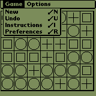
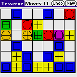
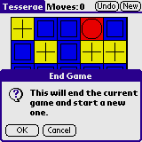
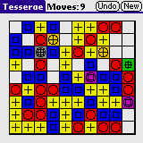
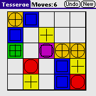
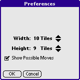

# Tesserae for the Palm

Tesserae is a single-player video game developed by Nicholas Schlott based on
[Kent Brewster's DOS game Stained Glass](https://web.archive.org/web/20121221084920/http://www.sff.net/people/k.brewster/).
and was first published in 1990. It commercially successful releases for
Macintosh, Windows 3.x, DOS, Nintendo Game Boy and Sega Game Gear.

And now PalmOS!









# History

I wrote this during Summer 2002 to learn the PalmOS SDK, C and Emacs.

I never completed the project and despite multiple attempts to get it
to a releasable state, I gave up Jan 2004 and dumped everything online
with a public domain license at [duckies.org/palm/tess](https://web.archive.org/web/20050108233132/http://duckies.org:80/palm/tess/).

Fast forward to 2024, I wrote a small
[tess_import](https://gist.github.com/notpeter/71e35a74a008d268057f564b76ff4f75)
to retroactively create a git history from my backup zips.

# Requirements

This targets PalmOS >= 3.0 in either monochrome or color with 160x160 pixel
displays. Various physical devices (Palm III, Palm IIIXE, Palm m500/m505/m515,
Zire, Tungsten T and multiple Sony Clies) were tested along with various ROMs
for the PalmOS Emulator (POSE).

Use on high-resolution devices (320x320) is untested.

# Issues

> The current version (2004-Jan-07) has a bug dealing with the detection of
> valid moves from the currently selected location. It happens if you click
> on a tile in the bottom two rows (broken pointers).
> Older versions (go back a few versions...like maybe till 2002 even) don't have that.

# Development Environment setup

TBD

Originally I used prc-tools under windows with cygwin.

# License

```
Originally Copyright (c) 2002-2004 Peter Tripp.

This is free and unencumbered software released into the public domain.

Anyone is free to copy, modify, publish, use, compile, sell, or
distribute this software, either in source code form or as a compiled
binary, for any purpose, commercial or non-commercial, and by any
means.
```

See [license.txt](license.txt) for more.
